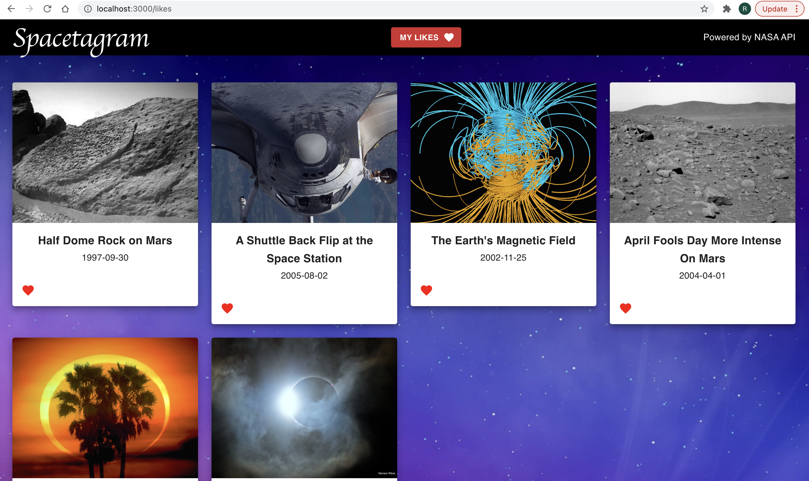
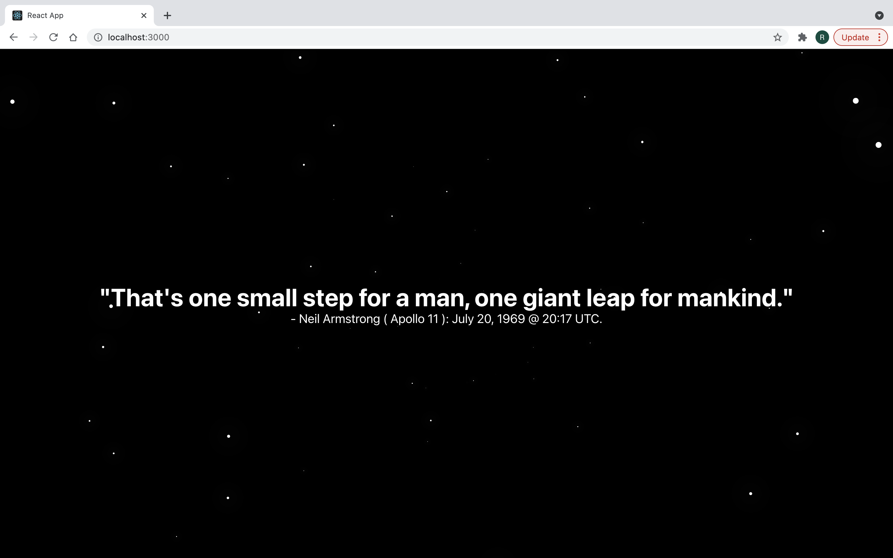
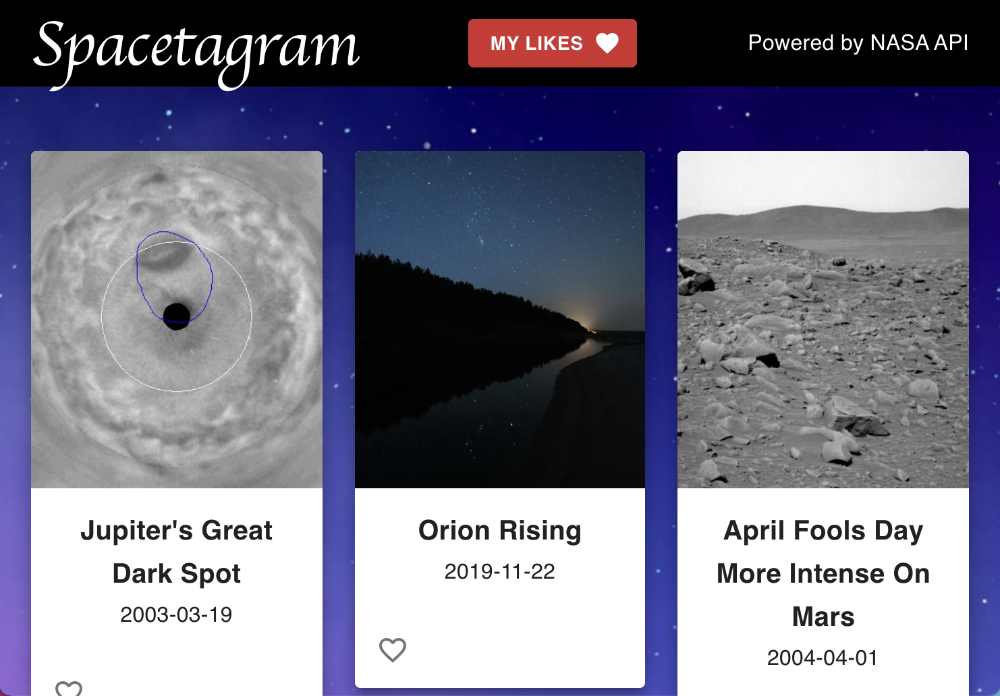

# Spacestagram

Spacestagram is a space image gallery designed for Shopify Intern Challenge 2022. It is a responsive web application that queries NASA Astronomy Picture of The Day(APOD) API to extract random images and display their information in a beautiful interface. It is developed in React.js and Material-UI and allows users to like and unlike images.

## Features
- [x] Users can like and unlike images using the animated heart icon.
- [x] Liked images are stored even if the user leaves or reloads the page.
- [x] Infinite Stars loading state animation while the data is fetched from the API.
- [x] Seemless navigation to My-Likes and Spacetagram homepage using React-Router.

## Links

- [CodeSandBox](http://codesandbox.io/s/spacestagram-shopify-ltyp2 "CodeSandBox")
- [Github Repo](https://github.com/Rishabhk06/spacestagram "Github Repo")

## Screenshots

- ### Home Page

- ### My Likes

- ### Infinite Stars loading state animation

- ### Responsiveness

## Installation
1. Clone the repository or download the zip file.
2. Setup your local environment.
3. Change the terminal directory using `cd spacetagram`.
4. Install the dependencies using `npm install`.
5. Run command `npm start` to start the application.

